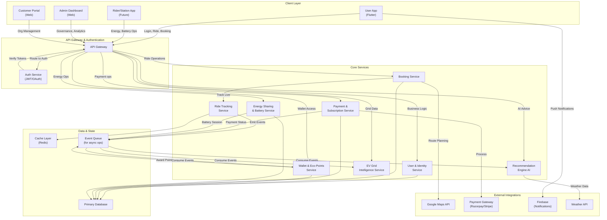
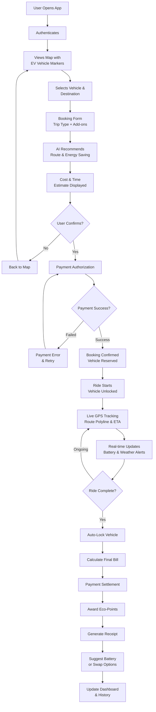
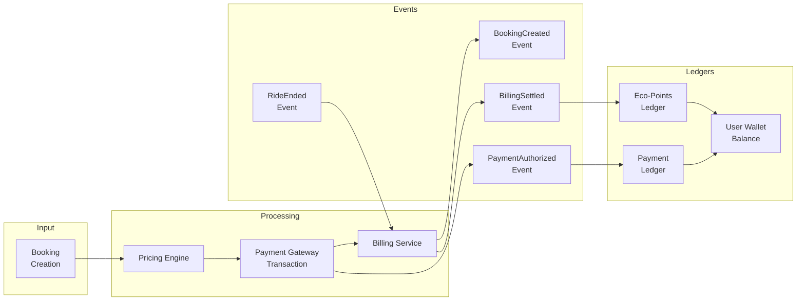
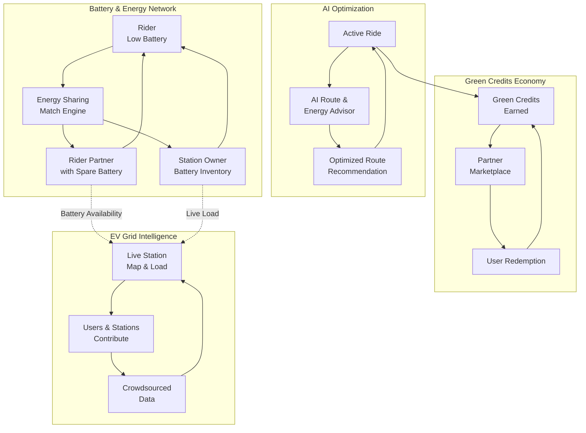
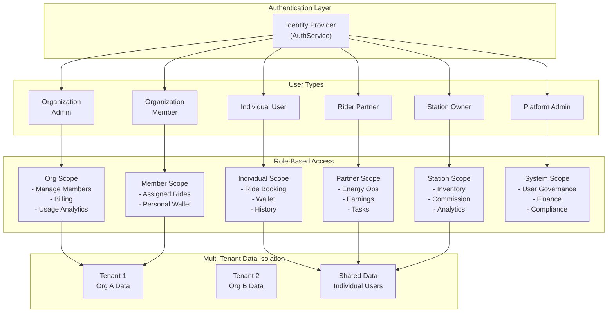
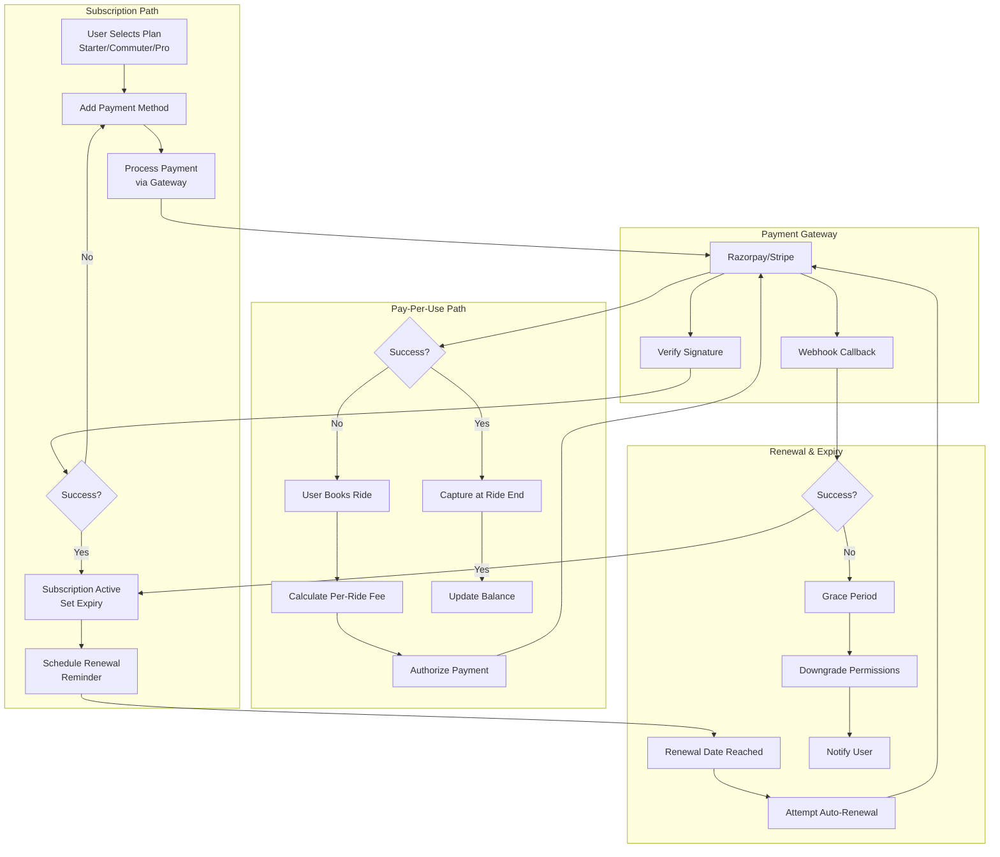

# 17 - Architecture Diagrams

## Purpose

Visual representations of RideEasy system architecture, data flows, and key processes for better understanding across all team members.

Yeh diagrams architecture ke complex concepts ko simple visual format me represent karte hain.

---

## 1. System Architecture Overview

**Key Components:**
- All client apps route through API Gateway for centralized auth and routing.
- Backend services are independent and communicate via event queue for scalability.
- Real-time tracking uses cache layer for performance.
- Payment and wallet operations are fully audited and append-only.

---

## 2. Complete Ride Lifecycle

**Key Steps:**
1. Authentication and map discovery.
2. Vehicle selection with AI-powered energy recommendations.
3. Payment authorization before booking confirmation.
4. Live tracking with real-time alerts during ride.
5. Automated lock, billing, and rewards settlement at end.
6. Optional battery/swap suggestions and post-ride dashboard update.

---

## 3. Data Flow: Booking to Settlement

**Important Principles:**
- Every financial transaction generates audit events.
- Payment and Eco-Points ledgers are append-only.
- Wallet balance is derived from ledger entries (never directly mutable).
- Event-driven architecture ensures consistency across services.

---

## 4. Innovation Streams: Ecosystem Interactions

**Differentiator Features:**
- Energy Sharing Network: connects desperate users with available resources.
- AI Energy Advisor: learns and improves route recommendations over time.
- Green Credits: incentivize ecosystem participation.
- Crowdsourced EV Intelligence: creates network externality effects.

---

## 5. RBAC and Multi-Tenant Architecture

**Security Model:**
- Every role has distinct permission boundaries.
- Organization data is strictly isolated.
- Admins have full audit trail visibility.
- Individual user data is cross-tenant accessible for shared services.

---

## 6. Payment & Subscription Workflow

**Critical Flows:**
- Subscription user gets recurring billing with grace period for failures.
- Pay-per-use user gets authorization hold and capture at ride completion.
- Renewal failures trigger grace period, then permission downgrade.
- All flows verify gateway signatures to prevent fraud.

---

## Diagram Usage Guide

- **System Architecture**: Share with new team members and stakeholders for high-level understanding.
- **Ride Lifecycle**: Reference for QA testing and edge case identification.
- **Data Flow**: Essential for backend engineers implementing payments and wallet operations.
- **Innovation Streams**: Present to product and business teams to understand differentiator complexity.
- **RBAC**: Use during permission audit and access review cycles.
- **Payment Workflow**: Critical for payment operations and finance reconciliation.

---

## Notes for Implementation

When actual code is added:
1. Add sequence diagrams for specific error recovery scenarios.
2. Map each service to actual microservice repository.
3. Add real-time event schema definitions.
4. Create deployment topology diagrams for DevOps planning.
5. Document failure mode scenarios for each critical path.
